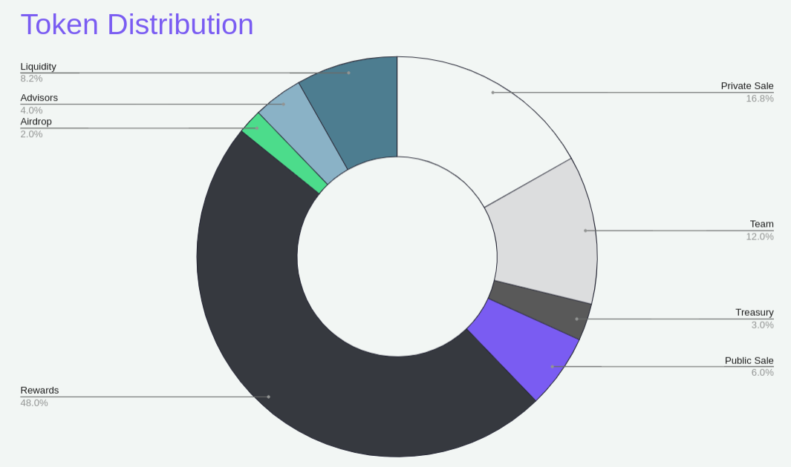
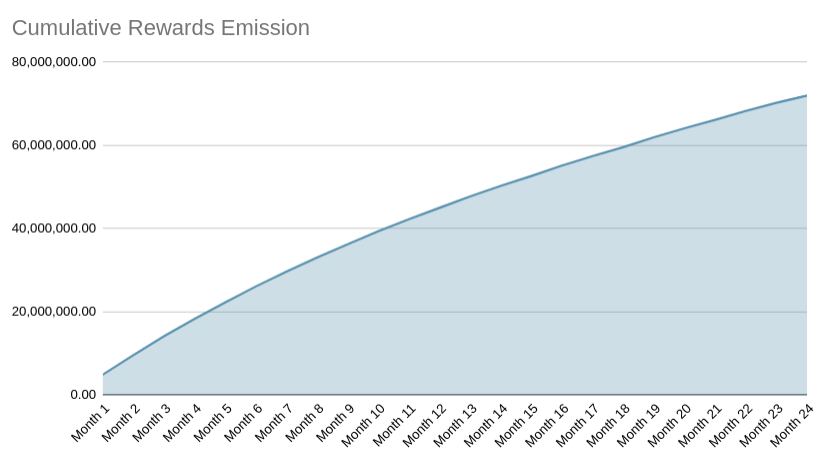

Snail Trail has a **single** native ERC-20 compliant token. Tokens will be rewarded to users through in-game mechanics and players will be able use these tokens on several mechanics.

### Utility

Tokens can be used while using below mechanics:

* Competitive Races
* Incubator
* Laboratory
* Microwave
* Micro-transactions (Cosmetics)
* And more...

### Tokenomics

**Supply:** 300,000,000

---

### Vesting

|    Type   |             Unlock Plan         |
|:---------:|:--------------------------------------------------------:|
|  Private  | 10% TGE, 18 month vest(6 month cliff, quarterly release) |
|   Public  |         25% at TGE(6 months vest, monthly release)        |
|    Team   |     2 years vest (12 month cliff, quarterly release)     |
|  Advisors |     2 years vest (12 month cliff, quarterly release)     |
| Liquidity |                        100% at TGE                       |
|   Reward  |                See: Rewards Emission Table               |

---

### Rewards Emission

**Rewards Supply:** 144,000,000

48% of total tokens are reserved for in-game rewards. 
* Half of the rewards will be distributed with in-game play-to-earn concepts for the first two years with respect to below table.
* Remaining half will be used for Tournaments, Seasonal Rewards, Bonuses, Future Game Modes, Failsafe Mechanisms and Upcoming Years.
* Below table is targeted emission amounts and might change with respect to in-game demands and activity.
* Rewards per daily missions (or any other future reward distributing mechanisms) are calculated and will be distributed to achieve the below emission targets. 

|   Month  | Targeted Rewards Emissions per Month | Cumulative Rewards Emissions |
|:--------:|:----------------------------:|----------------------|
| Month 1  |                 4,890,000 |         4,890,000 |
| Month 2  |                 4,710,000 |         9,600,000 |
| Month 3  |                 4,530,000 |        14,130,000 |
| Month 4  |                 4,170,000 |        18,300,000 |
| Month 5  |                 3,990,000 |        22,290,000 |
| Month 6  |                 3,810,000 |        26,100,000 |
| Month 7  |                 3,570,000 |        29,670,000 |
| Month 8  |                 3,390,000 |        33,060,000 |
| Month 9  |                 3,210,000 |        36,270,000 |
| Month 10 |                 3,090,000 |        39,360,000 |
| Month 11 |                 2,910,000 |        42,270,000 |
| Month 12 |                 2,730,000 |        45,000,000 |
| Month 13 |                 2,730,000 |        47,730,000 |
| Month 14 |                 2,550,000 |        50,280,000 |
| Month 15 |                 2,370,000 |        52,650,000 |
| Month 16 |                 2,490,000 |        55,140,000 |
| Month 17 |                 2,310,000 |        57,450,000 |
| Month 18 |                 2,130,000 |        59,580,000 |
| Month 19 |                 2,370,000 |        61,950,000 |
| Month 20 |                 2,190,000 |        64,140,000 |
| Month 21 |                 2,010,000 |        66,150,000 |
| Month 22 |                 2,130,000 |        68,280,000 |
| Month 23 |                 1,950,000 |        70,230,000 |
| Month 24 |                 1,770,000 |        72,000,000 |

---

