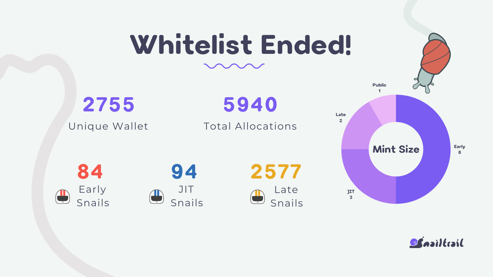

Snail Trail Whitelist Event held on official discord for **3 months** in between `28/Oct/2021` to `28/Jan/2021`.

The purpose of whitelist was;
* to allow more unique users to have a chance of minting Snail NFTs
* avoid whales
*  and create a fair minting process.
  
The goal was increasing unique user count for the game from day-zero which not only decreases the sell pressure on NFTs and consequenctly boost game economy but also provide a better and more distributed game experience for every player.

### First Round
First whitelist event is announced at `October 28th, 2021` and ended at `November 8th, 2021`. In which; 
* Users who joined discord before `October 28th` were able to claim Early Snail role.
* Users who joined discord in-between `October 28th` and `November 8th` were able to claim Just-In-Time Snail role.

### Second Round
Second whitelist event is announced at `December 28th, 2021` and ended at `January 29th, 2022`. In which;
* Users who joined discord after `November 8th` were able to claim Late Snail role.

### Participation
During whitelist, there were not any hard requirements. Anyone that verified their wallet through **Snailed** discord bot got the related whitelist role.

### Allocations
|     Role    | Allocation Size |
|:-----------:|:---------------:|
| Early Snail |        6        |
|  JIT Snail  |        3        |
|  Late Snail |        2        |

* Whitelisted users will be able to mint before official mint date.
* Public mint will start after the whitelist mint event. During that time, a wallet will be able to mint 1 snail.