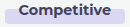

### How to Race in Competitive?

1. Head to the   menu.

2. Choose  tab.
3. Find a mission to race from the board.
4. Click  button.
5. Select a snail to race.

---

### Competitive Race Rules
| Property    | Value |
|:-----------:|:------------:|
| Participants    | 10      |
| Entry Fee   | [5-100] Tokens |
| Reward Pool | **9x** of entry fee  |
| Availability | Anytime  |
| Distances    | [10-42]  |

* Each race has 10 spots available.
* Races have an entrance fee. 
* Prize pools is fixed with respect to entrance fee(**9x**).
* Once spots are filled, a starting time will be assigned for the race.
* All snails will win native-tokens with respect to their ranking at the end of the race.
* Snails will gain/lose more ELO on competitive races than daily missions.

---

### Rewards
| Result    | Reward |
|:-----------:|:------------:|
| Winner    | **5x**      |
| Runner-up   | **2.5x** |
| Third | **1.5x**  |

The Winner gets **5x**, the Runner-Up gets **2.5x** and the Third Place gets **1.5x** of the entrance fee.

!!!warning
Snails that are not yet completed Placement Races cannot race on Competitive Races. A snail must complete 5 Placement Races to determine its ELO Ranking and corresponding League.
!!!

---

#### How many races can a snail participate at the same time?
There is not any limit on participation.

#### Which currency will be used for entering races? 
For entering races that have fees, you will require native-token in your wallet.

#### Will I be able to control my snail?
No. Your snail will race based on its traits. Genes, class, generation and adaptations of your snail affect its speed. Also your snails performance will change based on trail distances and trail conditions. You have to experiment with your snail to find perfect trails to optimize the results. 