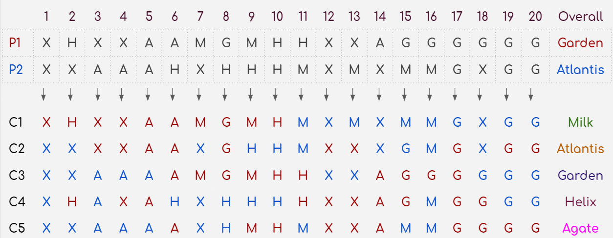
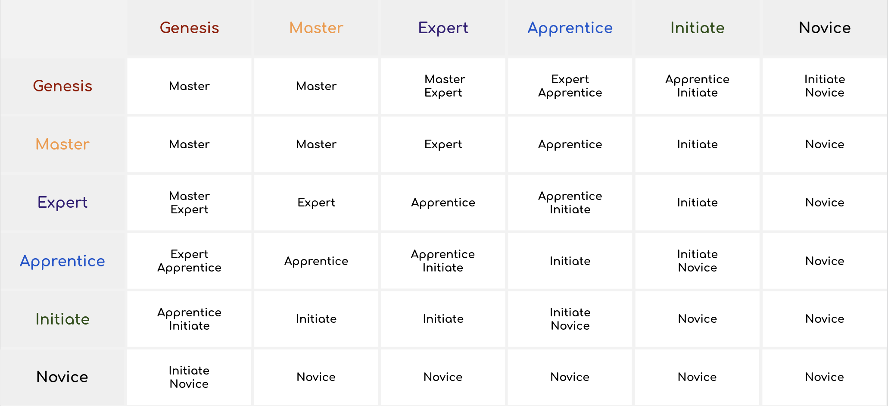
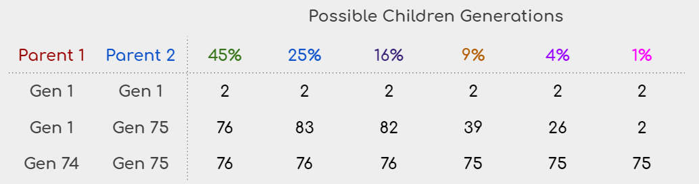

Each snail's DNA is formed from its 4 unique traits.‌ This page explains how incubation works for each trait and provides some examples.

---
### Family Crossing
In the Incubator process, both parents randomly contribute 10 genes to the offspring's genetic sequence. Let's assume we have the following **Parent 1** and **Parent 2** snails. Below is the genetic sequence of five possible offspring out of the 1000s possible ones that this couple can produce. This couple might have a child from any family. Their genetic sequence allows it.

[!ref icon=":house_with_garden:"](../../snails/racing_traits/family.md)

---
### Class Crossing
The following table describes how the offspring's class will be determined. If there are two options, the greater one will have a 10% chance while the lesser one will have a 90% chance.

As shown, mating with a Genesis class might generate better offspring for all of the other classes.
[!ref icon=":rainbow:"](../../snails/racing_traits/class.md)

---
### Generation
The generation algorithm is provided on the Traits page. Below are a few examples of possible results of different snail couples.

[!ref icon=":1234:"](../../snails/racing_traits/generation.md)

---
### Adaptation
Adaptations will be assigned randomly. Each snail starts with 1 random adaptation.
[!ref icon=":thermometer:"](../../snails/racing_traits/adaptation.md)