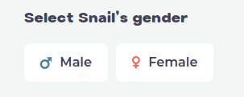

## Gender
Snails are **hermaphrodites** and they can use their reproduction systems however they like. In Snail Trail; 
* Each snail is born without a defualt gender. 
* Players can assign a gender to their snails or change the gender of their snails.
* Once a gender is registered, it cannot be changed for 30 days.

---
## Incubation

On the  page, player can either;

* Provide both a male and a female snail from their inventory, or
* Provide a female snail and buy a genome of another male from Gene Market to start breeding.

Owners can breed with their snails **once a month**. In each breed period:
* A **male** can donate a genome once. Donated genome can be sold three times on the **Gene Market**. 
  * After the genome donation, there will be a 30-day cooldown period before the next one starts.
* A **female** can lay eggs once. 
  * The eggs hatch instantly, no waiting period. 
  * 99.9% of the time only one snail hatches from an egg, but with a 0.1% chance, there might be twins.
  * After fertilization, there will be a 30-day cooldown period before the next one starts.
---
## Simulation

Once two snails are in place, players can use **Simulate** button to see probability of possibile offspring.

---

#### How long does a newborn have to wait for incubation?
A newborn cannot reproduce until its 30th day on Earth.

#### Does an evolved snail have to wait for incubation?
If the snail did not use its breeding right for the current cycle, then it can breed in the current cycle.